# 🛡️ Wazuh + Sysmon SIEM Lab – Windows Endpoint Monitoring

This project documents the complete deployment of Wazuh 4.11.2 on Ubuntu 22.04 and the integration of Sysmon on a Windows 11 virtual machine. The lab demonstrates the centralized monitoring of Windows endpoint behavior using custom rules in Wazuh to detect specific Sysmon events.

## 🎯 Objectives

Install and configure Wazuh (Manager, Indexer, Dashboard) on Ubuntu VM

Deploy the Wazuh agent on a Windows 11 virtual machine

Install Sysmon with a custom configuration on the endpoint

Monitor Sysmon events centrally via Wazuh

Create custom detection rules from the Wazuh dashboard

## 🧪 Environment

| Component       | Details                                  |
|-----------------|------------------------------------------|
| Host OS         | Windows 11 (with VirtualBox)             |
| Ubuntu VM       | Ubuntu 22.04 LTS (Wazuh Manager)         |
| Windows VM      | Windows 11 Home (Sysmon + Wazuh agent)   |
| Hypervisor      | VirtualBox                               |
| Networking Mode | Bridged Adapter                          |

## 📸 Setup Walkthrough

### 1. Virtual Machine Environment

Launching Ubuntu (for the Wazuh manager) and a Windows 11 VM (as monitored endpoint) in VirtualBox.

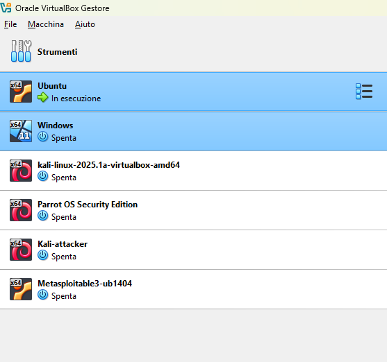

### 2. Ubuntu Update and Upgrade

Initial preparation with sudo apt update && sudo apt upgrade.

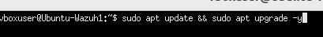

### 3. Downloading the Wazuh Installer Script

We use curl to fetch the official installer script.

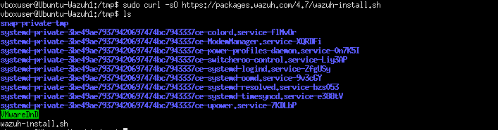

### 4. Granting Execution Rights

The script is made executable.

### 5. Installing the Wazuh Stack

We run the script using the -a all-in-one flag.

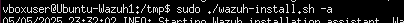

### 6. Web Interface Credentials

Installer provides credentials for the Wazuh Dashboard.

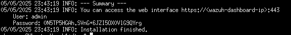

### 7. Logging into Wazuh Dashboard

Accessing the interface at https://<manager-ip>:443.

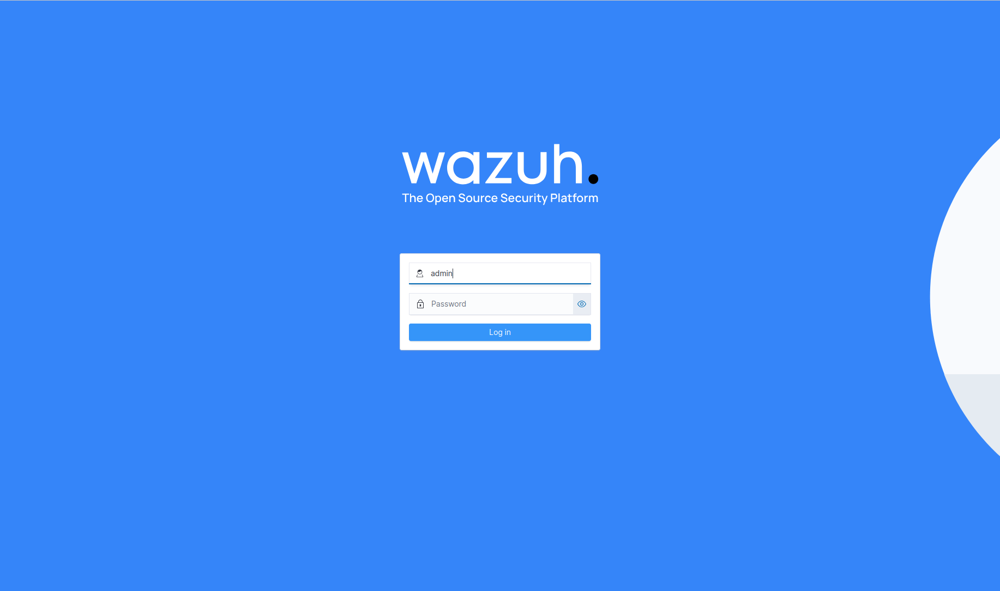

### 8. Deploying a New Agent

We create an agent entry for the Windows VM from the dashboard.

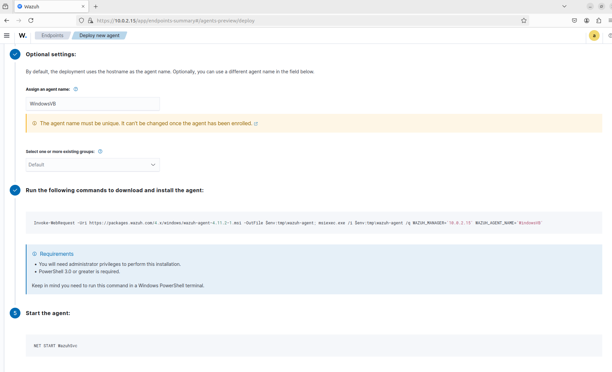

### 9. Installing Wazuh Agent on Windows

Commands generated by Wazuh are executed in PowerShell.

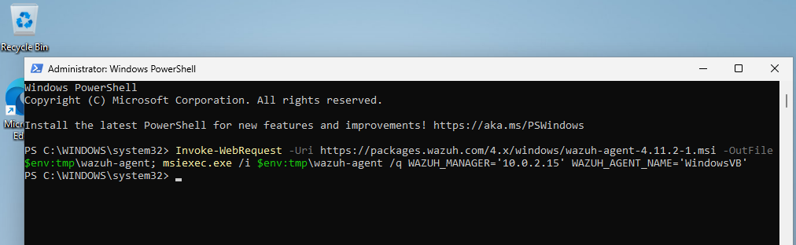

### 10. Starting the Agent Service

We confirm the service is running.

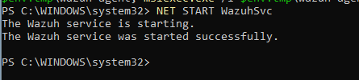

### 11. Confirming Agent Connection

Wazuh shows the new Windows endpoint as connected.

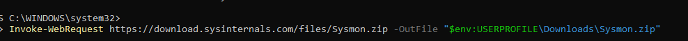

### 12. Installing Sysmon

We use PowerShell to download Sysmon.

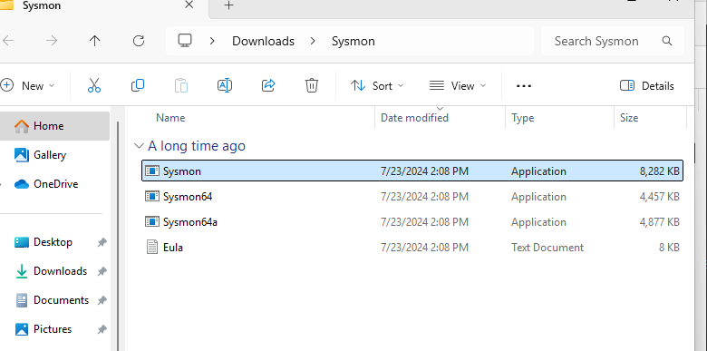

### 13. Extracting Sysmon Package

Unzipping and viewing the Sysmon executables.

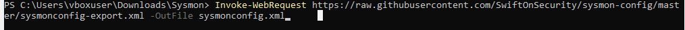

### 14. Downloading Sysmon Configuration

We fetch the SwiftOnSecurity config.

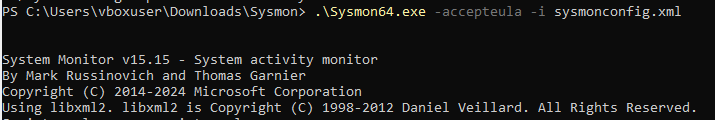

### 15. Installing Sysmon with Configuration

Sysmon is launched with the custom configuration.

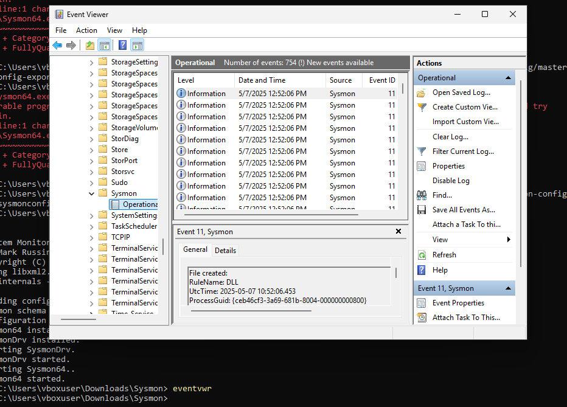

### 16. Verifying Logs in Event Viewer

Sysmon events appear under the Operational channel.

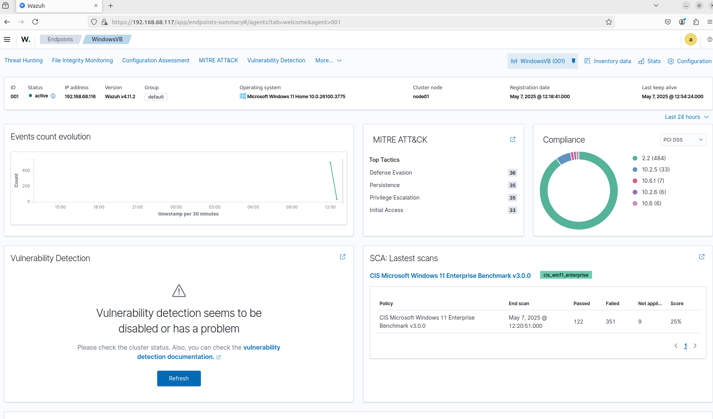

### 17. Checking the Wazuh Dashboard

Sysmon events are now ingested into the Wazuh platform.

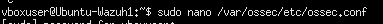

### 18. Enabling Vulnerability Detection

Uncommenting and configuring detection in ossec.conf.

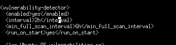

### 19. Restarting the Wazuh Manager

Apply configuration changes with a restart.

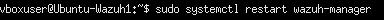

### 20. Verifying Vulnerability Scan Results

We now see compliance data in the dashboard.

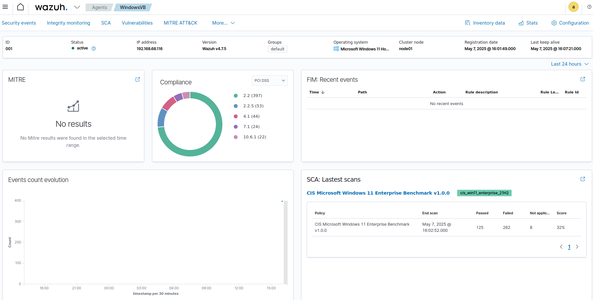

## 🔍 Creating and Testing Custom Rule

### 21. Navigating to Rule Management

Accessing the Wazuh dashboard to manage detection rules.

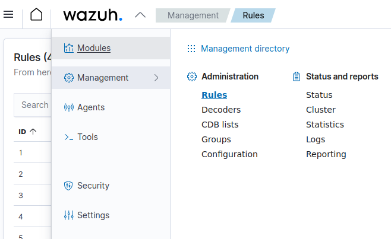

### 22. Adding a New Rule

Clicking on "Add new rules file" and selecting "Custom rules".

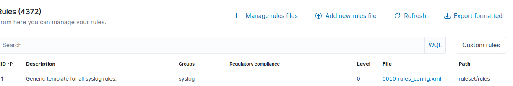

### 23. Writing the Rule

We define a rule to detect PowerShell execution based on Sysmon Event ID 1.

<group name="custom-windows-rules">
  <rule id="100100" level="10">
    <if_sid>61603</if_sid>
    <field name="win.eventdata.image">powershell.exe</field>
    <description>Uso di PowerShell rilevato da Sysmon</description>
  </rule>
</group>

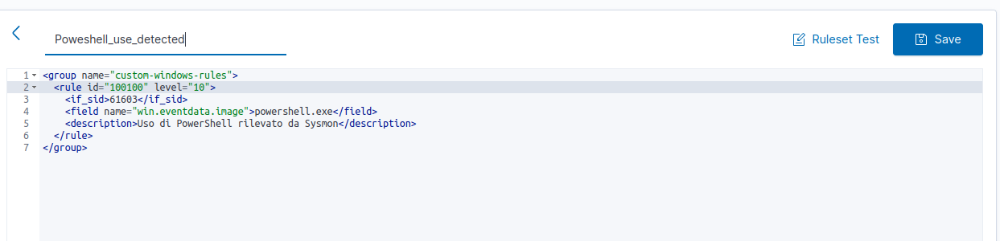

### 24. Triggering the Rule

We execute a PowerShell command to simulate malicious behavior.

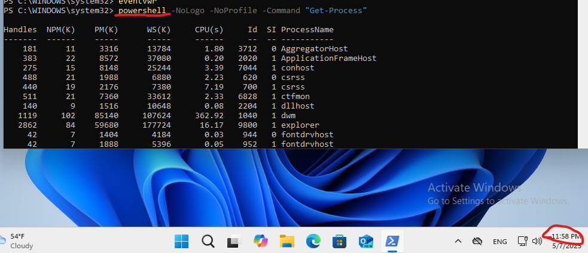

### 25. Searching for the Alert

We filter events in the Wazuh dashboard by rule ID.

### 26. Confirming Alert is Logged

The rule successfully triggered an alert.

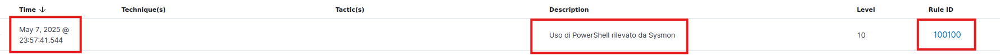

✅ Final Outcome

✅ Wazuh Stack installed on Ubuntu

✅ Windows 11 endpoint enrolled and monitored

✅ Sysmon events are parsed and forwarded to Wazuh

✅ Custom detection rule for PowerShell execution tested successfully

👤 Author

Created for the TryHackMe SOC Level 1 path as a demonstration of centralized endpoint monitoring using open-source tools.

Feel free to fork, adapt, and improve.
