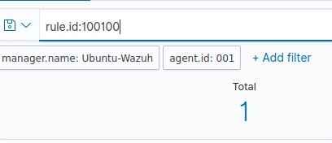

# 🛡️ Wazuh + Sysmon SIEM Lab – Windows Endpoint Monitoring

This project documents the complete deployment of Wazuh 4.11.2 on Ubuntu 22.04 and the integration of Sysmon on a Windows 11 virtual machine. The lab demonstrates the centralized monitoring of Windows endpoint behavior using custom rules in Wazuh to detect specific Sysmon events.

---

## 🎯 Objectives

_ Install and configure Wazuh (Manager, Indexer, Dashboard) on Ubuntu VM

_ Deploy the Wazuh agent on a Windows 11 virtual machine

_ Install Sysmon with a custom configuration on the endpoint

_ Monitor Sysmon events centrally via Wazuh

_ Create custom detection rules from the Wazuh dashboard

---

## 🧪 Environment

| Component       | Details                                  |
|-----------------|------------------------------------------|
| Host OS         | Windows 11 (with VirtualBox)             |
| Ubuntu VM       | Ubuntu 22.04 LTS (Wazuh Manager)         |
| Windows VM      | Windows 11 Home (Sysmon + Wazuh agent)   |
| Hypervisor      | VirtualBox                               |
| Networking Mode | Bridged Adapter                          |

---

## 📸 Setup Walkthrough

### 1. Virtual Machine Environment

We begin by launching two virtual machines in VirtualBox:

_ An Ubuntu VM that will act as the Wazuh server.

_ A Windows 11 VM that will serve as the monitored endpoint.

### 2. Ubuntu Update and Upgrade

On the Ubuntu VM, we update and upgrade the system packages to ensure a clean starting point:

### 3. Downloading the Wazuh Installer Script

We use curl to download the official Wazuh installation script directly from the Wazuh website.

### 4. Granting Execution Rights

Before running the script, we make it executable:

### 5. Installing the Wazuh Stack

We install the full Wazuh stack (manager, indexer, and dashboard) using the -a flag for an all-in-one deployment:

### 6. Web Interface Credentials

Upon installation, the script provides credentials for accessing the Wazuh Dashboard.

### 7. Logging into Wazuh Dashboard

We navigate to https://<manager-ip>:443 in a browser to verify that the dashboard is up and running.

---

### 8. Deploying a New Agent

From the dashboard, we add a new agent to register our Windows 11 machine.

### 9. Installing Wazuh Agent on Windows

We copy the agent installation command generated in the dashboard and run it in PowerShell on the Windows VM.

### 10. Starting the Agent Service

Once installed, we ensure the Wazuh Agent service is running properly.

---

### 11. Downloading Sysmon

We use the Invoke-Webrequest command to download Sysmon from the official website and we save it in the download folder.

### 12. Extracting Sysmon

The downloaded ZIP is extracted and Sysmon is prepared for installation.

### 13. Downloading Sysmon Configuration file

We download a widely-used configuration file from the SwiftOnSecurity GitHub repository.

### 14. Installing Sysmon with Configuration

Sysmon is installed with the downloaded configuration file to start logging detailed events.

### 15. Verifying Logs in Event Viewer

We verify that Sysmon is generating events by checking the “Operational” log channel in the Windows Event Viewer.

---

### 16. Checking the Wazuh Dashboard

We return to the dashboard to confirm that the Wazuh Manager is successfully receiving events from the Windows endpoint.; the Manager and the agent are connected and Sysmon events are now ingested into the Wazuh platform, but we can notice the Vulnerability Detection tool is turned off.

### 17. Opening Wazuh Configuration File

We proceed opening Wazuh configuration file, inside the Ubuntu Manager VB, to enable The Vulnerability Detection Tool.

### 18. Enabling Vulnerability Detection

We uncomment the related section in the configuration file and customize it changing the enable section to "yes".

### 19. Restarting the Wazuh Manager

To apply the new settings, we restart the Wazuh manager service.

### 20. Verifying Vulnerability Scan Results

Once enabled, vulnerability scan data becomes visible in the dashboard under the relevant section.

## 🔍 Creating and Testing Custom Rule

### 21. Navigating to Rule Management

Accessing the Wazuh dashboard to manage detection rules.

### 22. Adding a New Rule

From the dashboard, we navigate to the rules section to add a new custom rule.

### 23. Writing the Rule

We define a rule that detects execution of PowerShell via Sysmon (Event ID 1):

<group name="custom-windows-rules">
  <rule id="100100" level="10">
    <if_sid>61603</if_sid>
    <field name="win.eventdata.image">powershell.exe</field>
    <description>Uso di PowerShell rilevato da Sysmon</description>
  </rule>
</group>

### 24. Triggering the Rule

To test the rule, we run a PowerShell command on the Windows VM.

### 25. Searching for the Alert

Back in Wazuh, we filter the logs by rule ID to see if our custom rule triggered.

### 26. Confirming Alert is Logged

The dashboard confirms that the alert was successfully triggered, indicating our rule works as intended.

---

# Final Outcome

✅ Wazuh Stack installed on Ubuntu

✅ Windows 11 endpoint enrolled and monitored

✅ Sysmon events are parsed and forwarded to Wazuh

✅ Custom detection rule for PowerShell execution tested successfully

---

##### 👤 Project made by: Favaro Enrico
